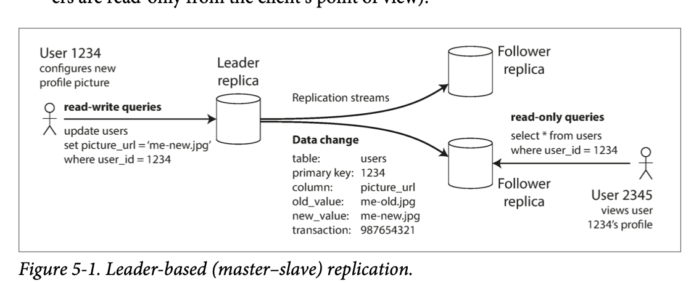
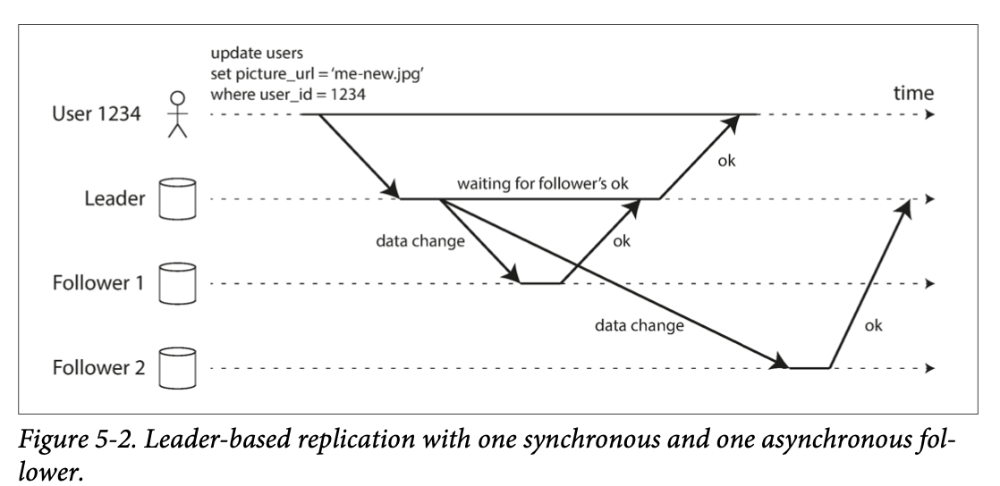
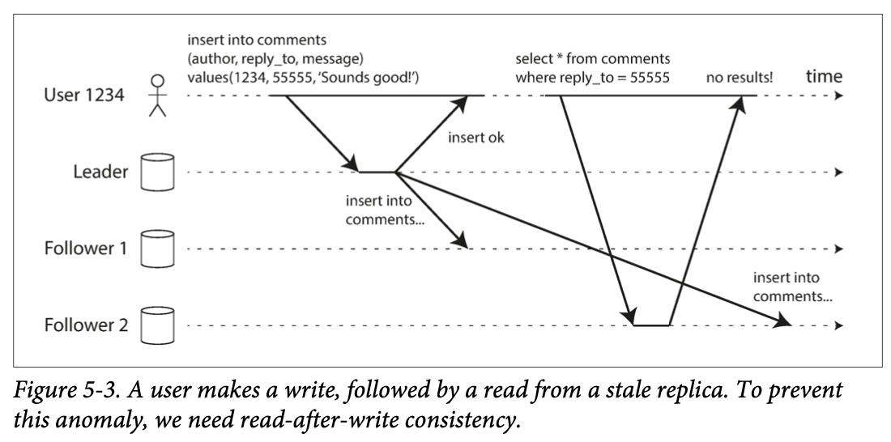

# The big ideas behind reliable, scalable, and maintainable systems

# Chapter 5  Replication
## Leaders and followers
- The leader handles all writes and reads
- Followers replicate the leader's log and handle only reads
- Followers can be promoted to leader if the leader fails
### Synchronous Versus Asynchronous Replication
- Synchronous: The leader waits until followers have confirmed that they received the write before reporting success to the user
- Asynchronous: The leader sends the write to the followers without waiting, and does not wait for acknowledgement from followers
- Synchronous is safer but slower
- Asynchronous is faster but risk losing data

### Setting up new followers
- Snapshot: The leader reads a snapshot of its database and sends the snapshot to the follower
- Log: The leader sends the follower the entire log from the beginning of time
- The follower can start processing queries as soon as it has received the snapshot or log
- The follower can request missing log entries from the leader
- The follower can request missing log entries from other followers
### Handling node outages
- If a follower fails, it can be discarded and replaced with a fresh copy
- If the leader fails, one of the followers must be promoted to be the new leader
- The leader must not accept writes from clients while it is recovering from a failure
- The leader must not accept writes from clients until the followers have caught up with the writes that were lost while the leader was down
### implementaion of replication logs
- Statement-based replication: The leader logs each write request (statement) that it executes, and sends that statement log to its followers
- Write-ahead log (WAL) shipping: The leader sends its entire WAL to its followers  
- Logical (row-based) log replication: The leader sends the data in its log in a form that is closer to the internal storage format of the database
- Trigger-based replication: The leader sends the data in its log in a form that is closer to the internal storage format of the database
## Problems with replication lag
### Reading your own writes
- If a client reads from the leader, it will always see the latest data
- If a client reads from a follower, it may not see the latest data

### Monotonic reads

### Consistent prefix reads
### Solutions for reading your own writes

