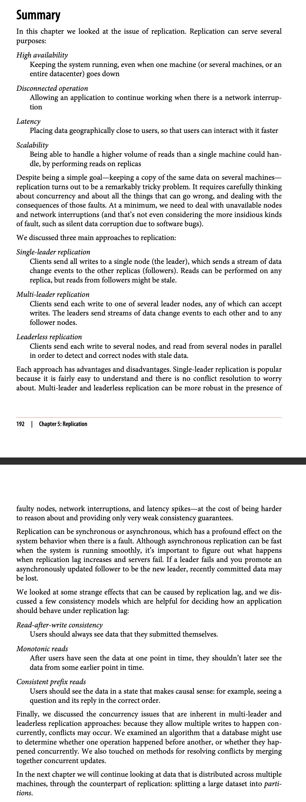

# The big ideas behind reliable, scalable, and maintainable systems

# Chapter 5  Replication
## Leaders and followers
- The leader handles all writes and reads
- Followers replicate the leader's log and handle only reads
- Followers can be promoted to leader if the leader fails
### Synchronous Versus Asynchronous Replication
- Synchronous: The leader waits until followers have confirmed that they received the write before reporting success to the user
- Asynchronous: The leader sends the write to the followers without waiting, and does not wait for acknowledgement from followers
- Synchronous is safer but slower
- Asynchronous is faster but risk losing data

### Setting up new followers
- Snapshot: The leader reads a snapshot of its database and sends the snapshot to the follower
- Log: The leader sends the follower the entire log from the beginning of time
- The follower can start processing queries as soon as it has received the snapshot or log
- The follower can request missing log entries from the leader
- The follower can request missing log entries from other followers
### Handling node outages
- If a follower fails, it can be discarded and replaced with a fresh copy
- If the leader fails, one of the followers must be promoted to be the new leader
- The leader must not accept writes from clients while it is recovering from a failure
- The leader must not accept writes from clients until the followers have caught up with the writes that were lost while the leader was down
### implementaion of replication logs
- Statement-based replication: The leader logs each write request (statement) that it executes, and sends that statement log to its followers
- Write-ahead log (WAL) shipping: The leader sends its entire WAL to its followers  
- Logical (row-based) log replication: The leader sends the data in its log in a form that is closer to the internal storage format of the database
- Trigger-based replication: The leader sends the data in its log in a form that is closer to the internal storage format of the database
## Problems with replication lag
### Reading your own writes
- If a client reads from the leader, it will always see the latest data
- If a client reads from a follower, it may not see the latest data

### Monotonic reads
#### How to define the  monotonic reads
    If a client has seen the data at some point, it should not later see the data in an older state
    If a client has read the value of a key and later reads the value of that same key again, it should see the same value or a newer value.
##### How to achieve monitonic reads
    Read from the leader or same user reads from the same replica. For example, the replica can be chosen base on a hash of the userId, rather than randomly

### Consistent prefix reads
#### what is the consistent prefix reads
    If a sequence of writes happens in a certain order, then anyone reading those writes will see them appear in the same order,
    but they may see only some of the writes.
#### How to achieve consistent prefix reads
    Read from the leader or same user reads from the same replica. For example, the replica can be chosen base on a hash of the userId, rather than randomly

### Solutions for replication lag
#### what is replication lag? why it is matter?
    Replication lag is the delay between the time a write is made on the leader and the time the change has been replicated to the followers.
    Replication lag is a problem because it means that reads from followers may be stale.
#### How to solve replication lag?
    1. Read-your-own-writes consistency
    2. Monotonic reads
    3. Consistent prefix reads
    4. Read-after-write consistency
    5. Bounded staleness
    6. Causal consistency
    7. Session guarantees
    8. Monotonic writes
    9. Consistent cross-channel reads
    10. Global snapshots
    11. Serializable snapshot isolation
    12. Repeatable read snapshot isolation
    13. External consistency
    14. Distributed transactions
    15. Multi-leader replication
    16. Leaderless replication
    17. Write conflicts
    18. Custom conflict resolution logic
    19. Multi-datacenter operation
    20. Handling node outages
    21. Handling network interruptions
    22. Detecting concurrent writes
    23. Resolving conflicts at read time
    24. Resolving conflicts at write time
    25. Custom conflict resolution logic
    26. Multi-leader replication
    27. Leaderless replication
    28. Write conflicts
    29. Custom conflict resolution logic
    30. Multi-datacenter operation
    31. Handling node outages
    32. Handling network interruptions
    33. Detecting concurrent writes
    34. Resolving conflicts at read time
    35. Resolving conflicts at write time
    36. Custom conflict resolution logic
    37. Multi-leader replication
    38. Leaderless replication
## Multi-leader replication
### what is the multi-leader replication
    Multi-leader replication means that writes can be made to any node and are then asynchronously replicated to other nodes.
### Use cases for multi-leader replication
    1. Multi-datacenter operation
        - If you have datacenters in different geographical regions, you want to serve users from their nearest datacenter
        - performance
        - tolerance of datacenter outages
        - tolerance of network problems

    2. Clients with offline operation
        appliation needs to be continue to work while it disconnected from the internet. Calender App.
        CouchDB
    3. Collaborative editing
        Real-time collaberative editing applications allow serveral people to edit a document simulataneously. For example, Google Docs, When one user edits the document, the changes are instantly applied to their local replica and asynchronously replicaed to the server and other users who are editting the same documents.
    4. Multi-user chat
        Multi-user chat is similar to collaborative editing, except that the data being edited is a chat room rather than a document.

### Handling write conflicts
    The biggest problem with multi-leader replication is that write conflicts can occur, which means that conflict resolution is required.

- Last write wins (LWW)
- Timestamp ordering
- Application-level conflict resolution
- Conflict avoidance
- Converging toward a consistent state
- Custom conflict resolution logic
    - on write
         - As soon as the database sysem detects a conflict in the log of replicated changes, it calls the conflict handler.
    - on read
        - when a conflict is detected, all the conflicting writes are stored, and the application is notified of the conflict when it reads one of the conflicting writes.
    - Automatic conflict resolution
        - The database system automatically resolves conflicts, without calling the application code.
        - Conflict-free replicated datatypes
        - mergeable persistent data structures
        - operational transformation
### Multi-leader replication topologies
   A replication topology is the arrangement of replication links between nodes.
   
    The most general toplogy is all-to-all, in which every leaders sends its writes to every other leaders.
    .   Mysql  by default supports only a circular toplogy, in which each leader only has one upstream leader and one downstream leader.

## Leaderless replication
### what is leaderless replication?
    Leaderless replication means that any node can accept a write and that writes are propagated asynchronously to other nodes.
    Single-leader replication is a special case of leaderless replication, where there is only one node that is allowed to accept writes at any given time.
    multi-leader replication is a special case of leaderless replication, where all nodes are allowed to accept writes at any given time.
    Some data storage systems take a different approach, abondoning the concept of leader and allowing any replica to directly accept writes from clients, this idea is forgotten during  the era of relational databases. And it once again became an popular architecture of database after Amazon Dynamo.Riak, Cassandra, and Voldemort are open source datastores with leaderless replication model inspired by Dynamo.
    - In some headerless implementations, the clients directly sends its writes to several replicas, while in others,  a cordinator node does this on behalf of the client.
#### Writing to the database when a node is Down
Imagine you hava a database with three replicas, and one of the replicas is currently unavailable - perhaps it is being rebooted to install a system update.\
    * In a leader-based system, if you want to continue processing writes, you may need to perform a failover to elect a new leaders.
    * On the other hand, in a leaderless configuration, failover does not exists.The client sends the write to all thress replicas in parallel, and the replicas that are currently available will accept the write.

    * solution : when a client reads from the database,  the read requests are also sent to several nodes in parallel, version number are used to determine which value is newer.
1. read repair and anti-entropy
        - read repair When a client read from several nodes in parallel, it can detet any stale responses, For example, user 2345 gets a version 6 value from replica 3 and a version 7 value from replica 1 and 2. This client sees that replica 3  has a stale value and write the newer value back to that replica. This approach works well for values that are frequently read.
        - Anti-entropy process some datastores have a background process that constantly looks for differences in the data between replicas and copies any missing data from one replica to another.
2. Quorums for reading and writing
        - If there are n replicas, every write must be confirmed by w nodes to be considered successful, and we must query at least r nodes for each read.(In our example, n= 3,w=2, and r =2). As long as w+r > n, the system can tolerate both unavailable nodes and delayed writes.
        - If w+r <= n, the system can tolerate only crashes, not slow or overloaded nodes.

#### Limations quorum consistency
-  monitoring the staleness
    -  For leader-based replication
        The leader can keep track of the replication lag of each follower, and it can refuse to serve reads from followers that are too far behind the leader. The database exposes metrics for the replication lag, which you can feed into a monitoring sytem.
    -  For leaderless replication
         The database can keep track of the version number of each key, and it can refuse to serve reads from replicas that are too far behind the latest version number. The database exposes metrics for the version number, which you can feed into a monitoring sytem.

#### Sloppy quorums and hinted handoff
- Sloppy quorums
    -  If a node is unavailable, the database can still process writes by temporarily reducing the durability guarantee.
    -  The database can temporarily accept writes even if they cannot be confirmed by the required number of replicas.
    -  The database can temporarily accept reads even if they cannot be confirmed by the required number of replicas.
- multi-datacenter operation
    leaderless replication is also suitabvle for multi-datacenter operation, since it is designed to tolerate conflicting concurrent writes, network interruptions and latency spikes.
    - Cassandra and vodement implements their multi-datacenter support within the normal leaderless model
    - Riak keeps all communication betweeen clients and database nodes local to one datacenter,
    so n describes the number of replicas within one datacenter.
#### Detecting concurrent writes

- last writes wins
- the happens-before relationship and concurrency
- capturing that happens-before relationship

- Mergin concurrently written values
- version vectors and vector clocks
    - A verison vectors is sometimes also called a vector clock.even though they are not quite the same. When comparing the state of replicas, version vectors are the right data structure to use.
## Summary 

# chapter 6 Partitioning
## Partitioning and Replication
- partitioning means that different parts of a data set are stored on different nodes.
- replication means keeping copies of the same data on multiple nodes, for increased durability and reduced latency.
- partitioning and replication are closely related, because most databases store each partition on multiple nodes for redundancy.
- The main reason for wanting to partition data is scalability.Different partitions can be assigned to different nodes, so partitions can be spread across multiple nodes.

## Partitioning of Key-Value Data
You hava a large amount of data, and you want to split it up into partitions so that different parts of the dataset are assigned to different nodes.How do we decide which node is responsible for which keys?
- partitioning by key range
    - The most common partitioning strategy is to assign a continuous range of keys to each partition.
    - The problem with this approach is that it is not very flexible: if you want to split or merge partitions, you have to move a lot of data around.  
    - The main reason why range partitioning is popular is that it works well with auto-incrementing primary keys.
    - The partition boundaries might be chosen manually by the database administrator, or they might be chosen automatically by the database system.
    - This partition strategy is used by Apache Cassandra, HBase, and RethinkDB.

    - volume 1 contains words starting with a, volume 2 contains words starting with b,  but volume 12 contains words starting with l, m, n, o, p, q, r, s, t, u, v, w, x, y, and z.In order to distribute the data evenly, you would need to split volume 12 into 16 volumes, one for each letter of the alphabet.
- partitioning by hash of key
    - A better approach is to choose the partition based on a hash of the key.
    - The hash function should be deterministic: for a given input value, it should always produce the same output, and different input values should ideally produce different output values.
    - The hash function should be randomized: if you hash several values that are similar, they should not all fall into the same partition.
    - A good hash function should take skewed data and make it uniformly distributed.
    - For partitioning, the hash function need not be cryptographically secure; it just needs to be good enough to distribute the data evenly across the partitions.
    - hash_code() functions which in many programming languages may not be suitable for partitioning because they are not randomizeda and the same key may have a different value in  different processes.

## Partitioning and Secondary Indexes
### partition of secondary indexes by document
- The simplest way to implement a secondary index is to build an index on each partition independently.
- The problem with this approach is that it does not allow efficient execution of queries that span multiple partitions.
- The solution is to use a distributed index, where the index is partitioned and distributed across nodes in the same way as the data.
- The most common way of implementing a distributed index is to use a document-partitioned index, where each index entry corresponds to a document on the same partition.
### partition of secondary indexes by term
- The term-partitioned indexes are more flexible than document-partitioned indexes, because they allow efficient execution of queries that span multiple partitions.
- The term-partitioned indexes are more complex to implement than document-partitioned indexes, because they require a distributed index that can efficiently find the documents containing a given term.

## Rebalancing Partitions
some changes for the dataset need to be rebalanced
- adding a new node
- machine faild
- dataset size increases
All those changes call for data and request to be moved from one node to another.
The process of moving load from one node in the cluster to another is called rebalancing. 
### strategies for rebalancing
- fixed number of partitions
    - The simplest way to rebalance is to have a fixed number of partitions, and to move partitions between nodes as necessary.
    - The problem with this approach is that it requires manual intervention when the cluster size changes.
- dynamic partitioning
    - The number of partitions is not fixed, but instead it is a function of the cluster size.
    - The number of partitions is proportional to the number of nodes in the cluster.
    - When a node is added to the cluster, the system automatically creates new partitions and moves some existing partitions to the new node.
    - When a node is removed from the cluster, the system automatically moves the partitions from that node to other nodes.
    - The advantage of this approach is that it does not require manual intervention when the cluster size changes.
    - The disadvantage is that it is more complex to implement.
- partitioning proportionally to nodes
    - The number of partitions is proportional to the number of nodes in the cluster.
    - When a node is added to the cluster, the system automatically creates new partitions and moves some existing partitions to the new node.
    - When a node is removed from the cluster, the system automatically moves the partitions from that node to other nodes.
    - The advantage of this approach is that it does not require manual intervention when the cluster size changes.
    - The disadvantage is that it is more complex to implement.
### operations: Automatic or manual rebalancing
- Automatic rebalancing
    - The database system automatically moves data around as machines are added and removed from the cluster.
    - The advantage of this approach is that it does not require manual intervention when the cluster size changes.
    - The disadvantage is that it is more complex to implement.It may cause the cluyter to be unstable.

## Request routing  
### what is the service discovery?
    Service discovery is the process of automatically finding out the IP address of a node that provides a given service.
### how to implement the service discovery?
- Allow clients to connect any node. if the node is not the right replica, it will forward the the request to the right node.
- Send all requests through a routing tier, which knows the network location of every node and can forward the request to the appropriate node.
- Use a separate service discovery mechanism, such as ZooKeeper, etcd, or Consul.

## Summary

In this chapter we explored different ways of partitioning  a large dataset into smaller subsets.Partitioning is necessary when you have so much data that storing and processing it on a single machine is no longer feasible.
The goal of partitioning is to spread the data and query load evenly across multiple machines, avoiding hot spots and bottlenecks. This requires choosing a  partitioning schema  that is appropriate for your data, and rebalancing the partitions when nodes are added or removed from the clusters.
Two main approaches to partitioning:
- Key range partitioning, where keys are stored, and a partition owns all the keys from some minimum up to some maximum. Sorting has the advantages that efficent range queries are possible, but there is a risk of hot spots if the application often accesses keys that are close together in the sorted order.
- Hashing partitioning, where a hash function is applied to each key, and  a partition owns a range of hashes. This methods destorys the ordering of keys, making range queries inefficient, but may distribute laod more evenly.

Hybird approaches are also possible, for example with a compound key: using one part of the key to identify the partition, and another part to identify the position within the partition.

We also discussed the interaction between partitioning and  secondary indexes. A secondary index also needs to be partitioned, and there are two methods:
- Document-partitioned indexes, where each partition has its own independent index.
- Term-partitioned indexes, where the index is partitioned in the same way as the data, and the index partitions are stored on the same nodes as the data partitions.

Finally, we discussed how to route requests to the appropriate partition. The simplest approach is to send all requests through a routing tier, which knows the network location of every node and can forward the request to the appropriate node. Alternatively, you can use a separate service discovery mechanism, such as ZooKeeper, etcd, or Consul.

